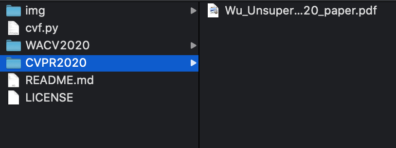

# CVF_Crawler

[](https://liuboss1992.github.io/)

Crawler for Computer Vision Foundation papers. Powered by [Boss Liu](https://liuboss1992.github.io/).

# Requirements
* python
* wget

# How To

Run **cvf.py**
```shell
$python cvf.py 
Index 1: CVPR 2020
Index 2: WACV 2020
Index 3: ICCV 2019
Index 4: CVPR 2019
Index 5: CVPR 2018
Index 6: ICCV 2017
Index 7: CVPR 2017
Index 8: CVPR 2016
Index 9: ICCV 2015
Index 10: CVPR 2015
Index 11: CVPR 2014
Index 12: ICCV 2013
Index 13: CVPR 2013
Index 14: ECCV 2018
Choose the Conference You Want, Print 0 to exit: 1
You choose to crawler CVPR 2020, print 1/0 to continue/exit.
1
Now Download Papers in CVPR 2020.
Downloading the 1th paper: Wu_Unsupervised_Learning_of_Probably_Symmetric_Deformable_3D_Objects_From_Images_CVPR_2020_paper.pdf
.
.
.
All Papers Downloaded!
```
You will download all of the papers you want in the corresponding folder.


# One More Thing
Welcome to follow my WeChat Subscription～


**刘老板的店**

